# SHIORI - Plataforma de Gestión de Contenido Asiático 🏮

## 1. Resumen del Proyecto

**SHIORI** es un ecosistema digital dinámico diseñado para centralizar, organizar y socializar el seguimiento de contenido audiovisual asiático, incluyendo K-Dramas, J-Dramas, Anime y otras producciones similares. La plataforma resuelve la fragmentación de información integrando metadatos globales con una capa de personalización profunda para el usuario.

### **Visión y Funcionalidad Core**
La aplicación no solo actúa como un catálogo informativo, sino como una herramienta de gestión personal:
*   **Gestión de Biblioteca y Ciclo de Vida:** Los usuarios pueden organizar su contenido en diversos estados técnicos, como **Viendo, Visto** y otros estados de seguimiento, permitiendo un control total sobre su historial.
*   **Sincronización Inteligente:** Uso de tareas programadas para actualizar metadatos y calendarios automáticamente desde fuentes oficiales de datos globales.
*   **Comunidad Segura:** Sistema de reseñas con filtros de moderación y herramientas de reporte para garantizar un entorno de intercambio de opiniones saludable.
*   **Diseño Premium:** Interfaz totalmente responsiva con estética moderna, garantizando una experiencia de usuario fluida y de alto nivel en cualquier tipo de dispositivo.

---

## 2. Tecnologías Utilizadas

El stack tecnológico ha sido seleccionado para equilibrar la rapidez de desarrollo con la seguridad y el rendimiento en producción.

### **2.1. Backend y Lógica de Servidor**
*   **Python 3.10 & Flask:** Micro-framework que gestiona la lógica de negocio, rutas y API interna. Se eligió por su ligereza y capacidad de extensión.
*   **Flask-SQLAlchemy (ORM):** Interfaz para la base de datos que abstrae las consultas SQL en objetos de Python, previniendo ataques de inyección y facilitando la escalabilidad.
*   **Werkzeug Security:** Motor encargado del hasheo y verificación de contraseñas mediante algoritmos de alta seguridad.
*   **Flask-Login:** Gestión de estados de autenticación y protección de rutas privadas.
*   **APScheduler:** Motor de tareas en segundo plano que ejecuta la sincronización diaria de episodios y la actualización de estados globales.

### **2.2. Base de Datos y Persistencia**
*   **Supabase (PostgreSQL):** Motor de base de datos relacional de nivel empresarial para gestionar relaciones complejas entre usuarios, colecciones y moderación.
*   **Row Level Security (RLS):** Implementación de seguridad a nivel de motor de base de datos. Cada petición es validada para asegurar que un usuario solo pueda interactuar con sus propios registros.

### **2.3. Frontend y UI/UX**
*   **Vanilla CSS3:** Uso extensivo de *Custom Properties* (variables) para un sistema de diseño consistente. Se evitan frameworks externos para maximizar la velocidad de carga.
*   **JavaScript (ES6+):** Implementación de lógica dinámica en el cliente para gestionar interacciones asíncronas mediante AJAX, permitiendo la actualización de elementos como favoritos, votos o estados de colección sin recarga de página, además de alimentar componentes dinámicos como el calendario.
*   **Backdrop-Filter (Glassmorphism):** Técnica de diseño para lograr efectos de transparencia y desenfoque avanzados en la interfaz.

### **2.4. Integraciones de Terceros**
*   **TMDB API v3:** Fuente de metadatos, imágenes en alta resolución, trailers y recomendaciones personalizadas.
*   **Google OAuth 2.0:** Implementado mediante la librería `Authlib` para ofrecer un sistema de registro seguro en un solo clic, permitiendo una transición fluida de usuario invitado a registrado.
*   **Deep-Translator (Google Engine):** Módulo de traducción integrado que procesa las sinopsis originales y biografías, sirviéndolas en castellano para mejorar la accesibilidad.
*   **TMDB Watch Providers (Powered by JustWatch):** Integración para mostrar de forma dinámica en qué plataformas de streaming legales está disponible el contenido según la región del usuario.

---

## 3. Modelo de Datos y Estructura de Base de Datos

La arquitectura de SHIORI se fundamenta en un modelo relacional robusto que garantiza la integridad y la persistencia de la información.

### **3.1. Diagrama Entidad-Relación**

El siguiente diagrama ilustra las conexiones principales del sistema, destacando el flujo desde la actividad del usuario hasta la supervisión administrativa.

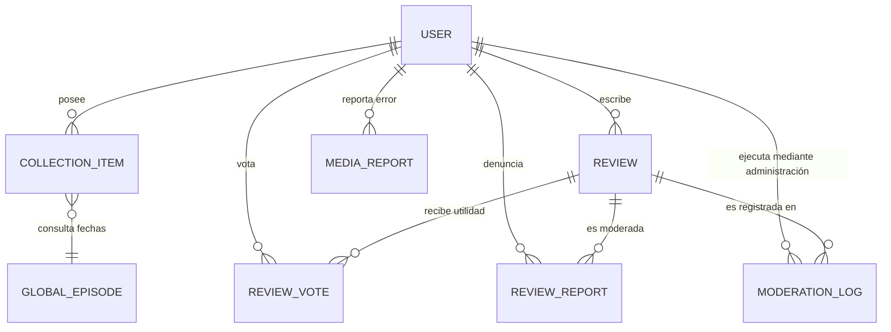

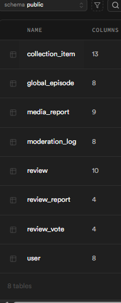


### **3.2. Especificación Técnica de las Tablas**

#### **A. Tabla `user` (Usuarios)**
| Campo | Tipo | Restricciones | Descripción |
| :--- | :--- | :--- | :--- |
| `id` | `int4` | Primary | Identificador único. |
| `username` | `varchar` | Nullable Unique | Nombre de usuario. |
| `email` | `varchar` | Nullable Unique | Correo electrónico. |
| `password_hash`| `varchar` | Nullable | Hash de la contraseña. |
| `region` | `varchar` | Nullable | Región del usuario. |
| `profile_image` | `varchar` | Nullable | Imagen de perfil. |
| `is_admin` | `bool` | Nullable | Flag de administrador. |
| `is_banned` | `bool` | Nullable | Flag de baneo. |

#### **B. Tabla `collection_item` (Biblioteca)**
| Campo | Tipo | Restricciones | Descripción |
| :--- | :--- | :--- | :--- |
| `id` | `int4` | Primary | ID del registro. |
| `user_id` | `int4` | **FK a `user(id)`** | ID del usuario propietario. |
| `media_id` | `int4` | Nullable | ID del medio (TMDB). |
| `media_type` | `varchar` | Nullable | Categoría del contenido, incluyendo películas, series y producciones similares. |
| `title` | `varchar` | Nullable | Título del medio. |
| `original_title`| `varchar` | Nullable | Título original. |
| `poster_path` | `varchar` | Nullable | Ruta del póster. |
| `vote_average` | `float8` | Nullable | Nota media de TMDB. |
| `flag` | `varchar` | Nullable | Etiqueta adicional. |
| `status` | `varchar` | Nullable | Estado de progreso en la visualización, incluyendo opciones de seguimiento personalizadas. |
| `is_favorite` | `bool` | Nullable | Marcador de favoritos. |
| `media_subtype` | `varchar` | Nullable | Subtipo de contenido. |
| `created_at` | `timestamp` | Nullable | Fecha de creación. |

#### **C. Tabla `review` (Reseñas)**
| Campo | Tipo | Restricciones | Descripción |
| :--- | :--- | :--- | :--- |
| `id` | `int4` | Primary | ID de la reseña. |
| `user_id` | `int4` | **FK a `user(id)`** | ID del autor de la crítica. |
| `media_id` | `int4` | - | ID del medio evaluado. |
| `media_type` | `varchar` | - | Tipo del medio. |
| `rating` | `float8` | Nullable | Valoración del usuario. |
| `comment` | `text` | Nullable | Contenido de la crítica. |
| `status` | `varchar` | Nullable | Estado de moderación administrativa para el control de visibilidad pública. |
| `report_count` | `int4` | Nullable | Contador de denuncias. |
| `created_at` | `timestamp` | Nullable | Fecha de publicación. |
| `media_title` | `varchar` | Nullable | Título del medio. |

#### **D. Tabla `global_episode` (Sincronización)**
| Campo | Tipo | Restricciones | Descripción |
| :--- | :--- | :--- | :--- |
| `id` | `int4` | Primary | ID único. |
| `media_id` | `int4` | Nullable | ID global de TMDB. |
| `media_type` | `varchar` | Nullable | Tipo de contenido. |
| `season_number`| `int4` | Nullable | Número de temporada. |
| `episode_number`| `int4` | Nullable | Número de capítulo. |
| `air_date` | `date` | - | Fecha de estreno oficial. |
| `title` | `varchar` | Nullable | Título del episodio. |
| `last_updated` | `timestamp` | Nullable | Última actualización. |

#### **E. Tabla `media_report` (Reportes de Datos)**
| Campo | Tipo | Restricciones | Descripción |
| :--- | :--- | :--- | :--- |
| `id` | `int4` | Primary | ID del reporte. |
| `user_id` | `int4` | **FK a `user(id)`** | Usuario informante de la incidencia. |
| `media_id` | `int4` | - | ID del medio. |
| `media_type` | `varchar` | - | Tipo de medio. |
| `media_title` | `varchar` | Nullable | Título del medio. |
| `field_type` | `varchar` | - | Tipo de error reportado. |
| `description` | `text` | - | Detalle de la incidencia. |
| `status` | `varchar` | Nullable | Estado actual de la incidencia para su gestión y resolución. |
| `created_at` | `timestamp` | Nullable | Fecha del reporte. |

#### **F. Tabla `moderation_log` (Auditoría)**
| Campo | Tipo | Restricciones | Descripción |
| :--- | :--- | :--- | :--- |
| `id` | `int4` | Primary | ID del registro. |
| `author_id` | `int4` | **FK a `user(id)`** | Administrador que ejecuta la acción. |
| `reporter_id` | `int4` | **FK a `user(id)`** | Usuario que originó el reporte inicial. |
| `review_id` | `int4` | **FK a `review(id)`** | Reseña que ha sido objeto de moderación. |
| `review_content_snapshot`| `text` | Nullable | Captura del texto original (para auditoría post-borrado). |
| `action` | `varchar` | Nullable | Accion administrativa. |
| `reason` | `varchar` | Nullable | Motivo técnico o de normas de la comunidad. |
| `created_at` | `timestamp` | Nullable | Fecha y hora de la acción. |

#### **G. Tabla `review_vote` (Votos de Utilidad)**
| Campo | Tipo | Restricciones | Descripción |
| :--- | :--- | :--- | :--- |
| `id` | `int4` | Primary | Identificador único del voto. |
| `user_id` | `int4` | **FK a `user(id)`** | Usuario que emite el voto. |
| `review_id` | `int4` | **FK a `review(id)`** | Reseña que recibe el voto de utilidad. |
| `vote_type` | `varchar` | - | Tipo de valoración emitida. |

#### **H. Tabla `review_report` (Denuncias de Comunidad)**
| Campo | Tipo | Restricciones | Descripción |
| :--- | :--- | :--- | :--- |
| `id` | `int4` | Primary | Identificador de la denuncia. |
| `user_id` | `int4` | **FK a `user(id)`** | Usuario que informa del problema. |
| `review_id` | `int4` | **FK a `review(id)`** | Contenido objeto de la denuncia administrativa. |
| `created_at` | `timestamp` | Nullable | Fecha y hora del reporte. |

---

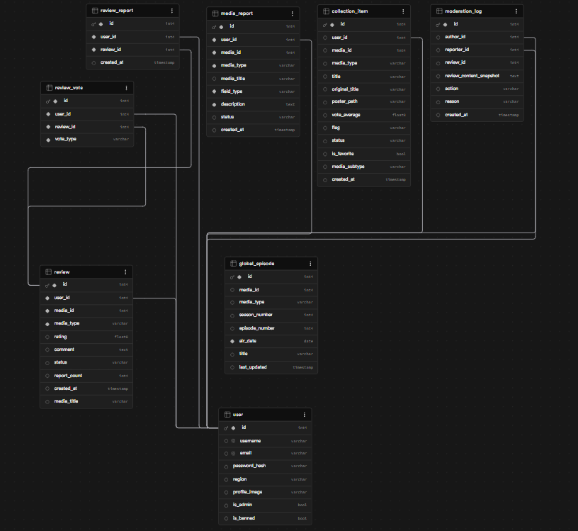

## 4. Roles Usados

El sistema define tres niveles de privilegios para estructurar la interacción y la seguridad de la plataforma:

### **4.1. Usuario Invitado**
Representa al usuario no autenticado. Tiene acceso limitado a la consulta de información pública y al catálogo global, actuando como el primer punto de contacto con la plataforma.

### **4.2. Usuario Registrado**
Usuario autenticado mediante credenciales propias o Google OAuth. Posee una base de datos personal dentro del sistema, permitiéndole gestionar su biblioteca, interactuar socialmente y colaborar en la integridad de los datos mediante reportes.

### **4.3. Administrador (Shiori Admin)**
Cuenta con privilegios elevados para la gestión integral de la plataforma. Su rol es crítico para la salud de la comunidad, encargándose de la moderación de contenido, la resolución de incidencias técnicas y el control de accesos.

---

## 5. Casos de Uso (Funcionalidad por Rol)

A continuación se detalla la experiencia operativa completa dentro de SHIORI, describiendo con precisión cada herramienta y flujo disponible según el perfil de acceso.

### **5.1. Escenario: Usuario Invitado (Público)**
El objetivo de este rol es la exploración libre del catálogo y el descubrimiento de contenido asiático.
*   **Pantalla de Inicio:** Visualización de tendencias globales con opción de filtrar por ventana temporal (Hoy o Esta Semana).

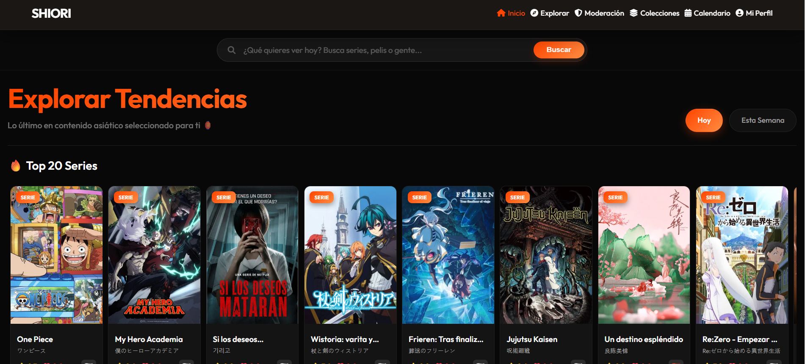
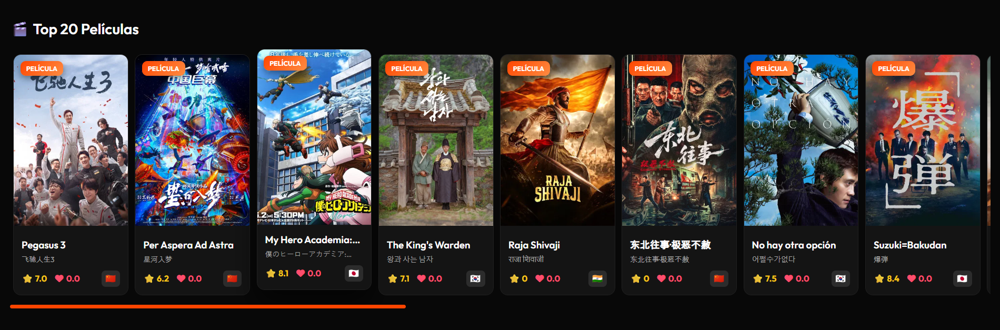
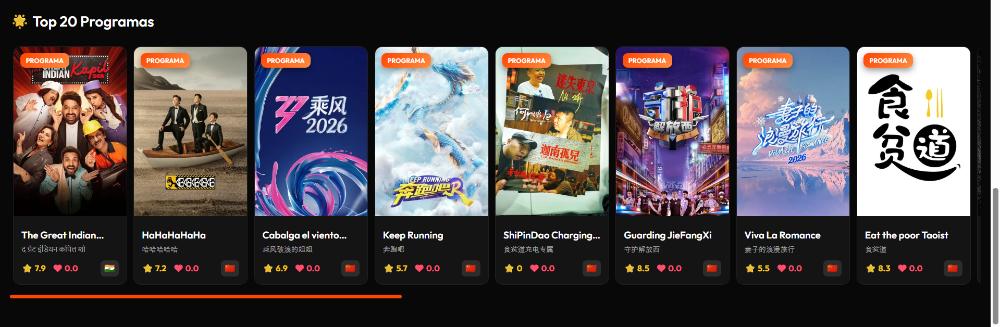

*   **Buscador Inteligente:** Motor de búsqueda que procesa simultáneamente títulos de series, películas, programas, personas y palabras clave (ej: una búsqueda de "infierno" devolverá coincidencias en estas 5 categorías).


*   **Sección Explorar:** Acceso a un sistema de filtrado profesional que incluye:
    *   **Capa Técnica:** Filtrado por palabras clave, tipo de producción, estado de emisión (para series y programas) y año.
    *   **Capa Cultural:** Inclusión o exclusión de géneros y selección de país de origen.
    *   **Capa de Disponibilidad:** Localización de plataformas de streaming ("¿Dónde quieres ver?"). Por defecto se muestra la oferta en España, permitiendo al invitado cambiar el país manualmente.
    *   **Ordenación Avanzada:** Clasificación por popularidad, fecha de estreno, volumen de votos o valoración (tanto en orden ascendente como descendente).

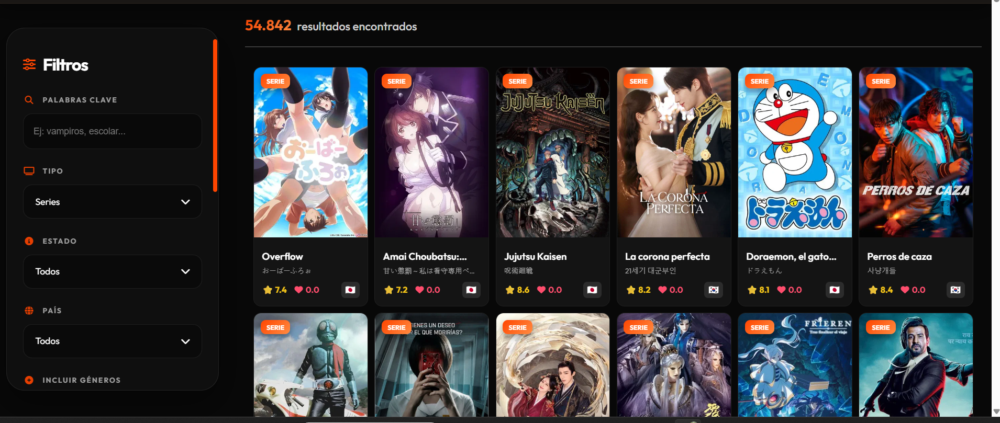

*   **Fichas Detalladas:**
    *   **De Medios:** Acceso a metadatos, links externos, sinopsis, reparto principal, temporadas, palabras clave, carrusel de recomendaciones y lectura de opiniones de la comunidad.

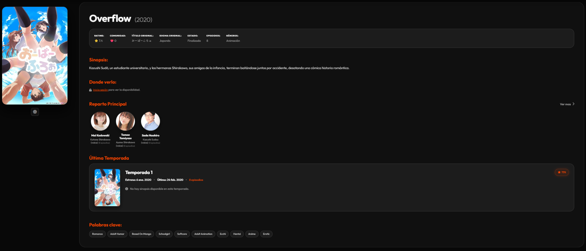
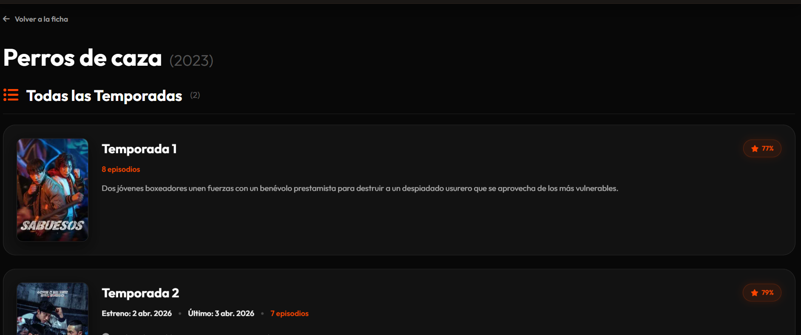
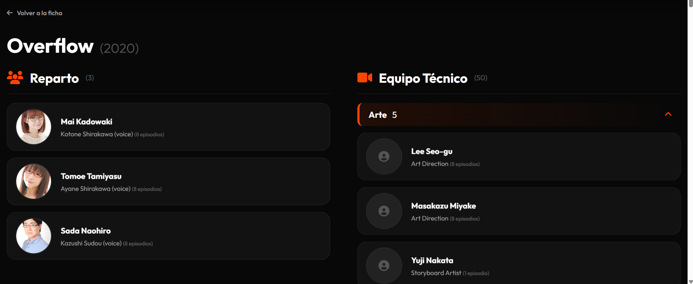


*   **De Personas:** Consulta de metadatos, biográfica, enlaces oficiales y filmografía completa.

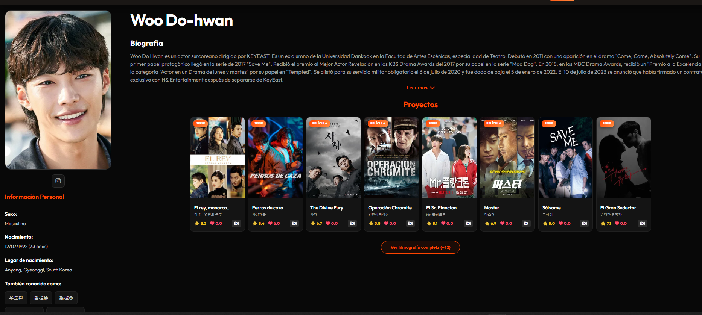

*   **Gestión de Acceso:** Funcionalidades de registro, inicio de sesión y recuperación de contraseña.

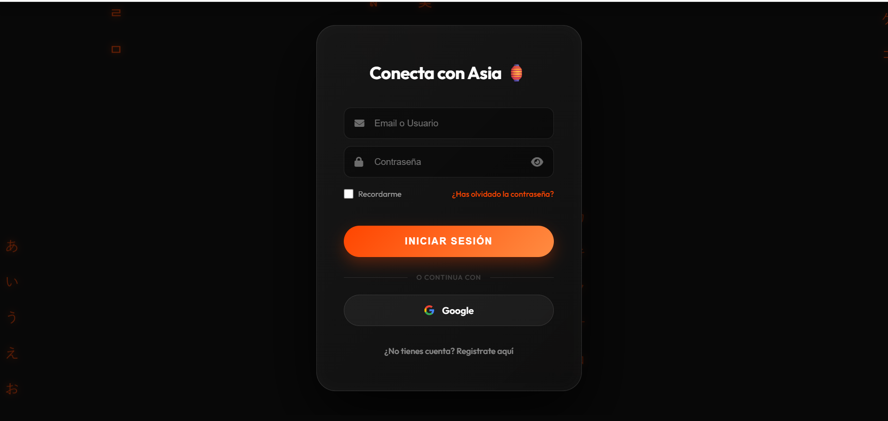
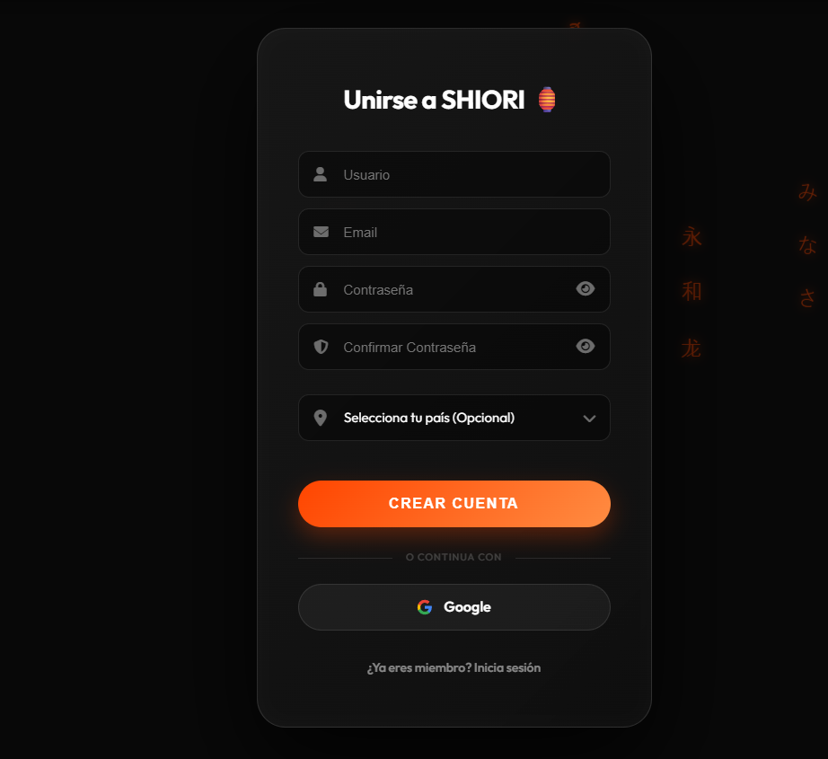


### **5.2. Escenario: Usuario Registrado (Personalización y Social)**
Suma a las capacidades del invitado una capa de gestión personal y participación activa.
*   **Interacción en Medios:** Desbloqueo de botones para marcar **Favoritos**, añadir a **Colecciones** personales y **Reportar Errores** de datos.

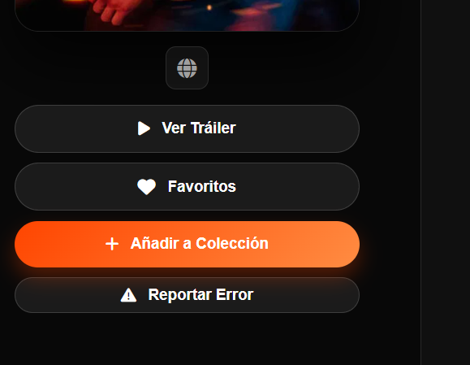

*   **Reporte de Errores (Media):** Flujo de dos pasos para notificar incidencias en la ficha.
    *   **Paso 1:** Selección de la categoría del error (Sinopsis, Reparto, Plataformas, etc.).
    *   **Paso 2:** Descripción detallada del problema.


*   **Streaming Personalizado:** La disponibilidad en plataformas se ajusta automáticamente al país configurado en el perfil del usuario (en caso de no estar configurado en la ficha no sale la info y en Explorar funciona como cuando eres invitado).


*   **Sistema de Opiniones:**
    *   **Propias:** Capacidad de añadir, editar y eliminar su propia opinión.
    *   **Comunitarias:** Posibilidad de votar otras reseñas y reportar aquellas que infrinjan las normas.


*   **Interacción en Personas:** Botón específico para reportar errores en la ficha de una persona, con selección de categoría y campo de texto para aclaraciones.


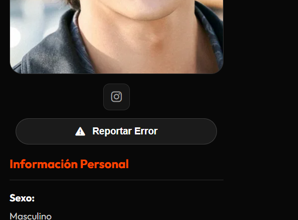


*   **Nuevas Secciones Privadas:**
    *   **Mis Colecciones:** Panel centralizado con todo el contenido guardado por el usuario.


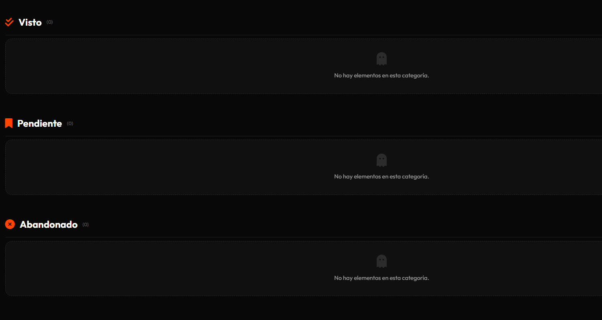

*   **Calendario:** Agenda dinámica con fechas de capítulos para series/programas y fechas de estreno para películas.

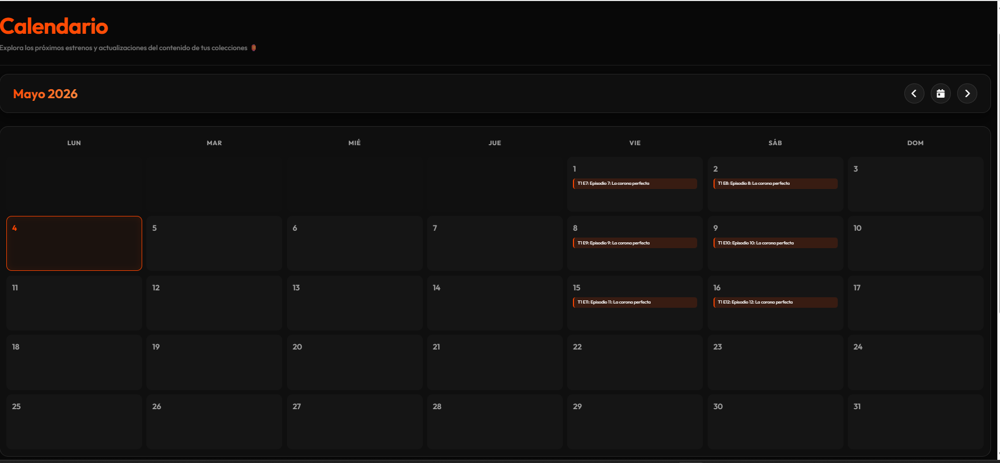
*   **Panel de Perfil:**
    *   **Visualización:** Foto de perfil, nombre de usuario y cajas informativas con la cantidad de ítems en cada estado de su colección.
    *   **Gestión de Cuenta:** Opciones de cerrar sesión y **Eliminar Cuenta** (proceso de purga de datos).
    *   **Edición de Perfil:** Interfaz para subir nueva foto, cambiar username, correo o contraseña, y configurar la **Región de Preferencia** para personalizar la información de streaming.


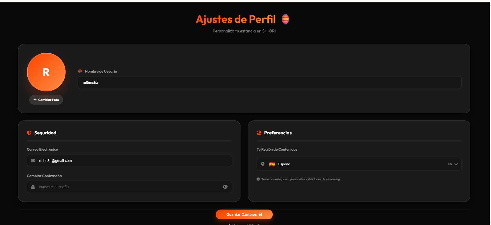


### **5.3. Escenario: Administrador (Moderación y Control)**
El administrador dispone de las mismas funciones que un usuario registrado, transformando las herramientas de interacción en herramientas de control absoluto.
*   **Gestión de Opiniones:** Desaparece el botón de "reportar" y se activa el de **Borrar** en todas las opiniones de la plataforma.


*   **Sección de Moderación (Exclusiva):**
    *   **Gestión de Usuarios Baneados:** Acceso a una lista de usuarios baneados.
    *   **Auditoría de Historial de Usuario:** Capacidad de acceder al expediente detallado de cualquier usuario, el cual incluye:
        *   **Contadores de Actividad:** Métricas de opiniones públicas vs. borradas, denuncias aceptadas vs. rechazadas, e informes de errores arreglados vs. ignorados.
        *   **Historial de Borrados:** Registro detallado de opiniones eliminadas (mostrando contenido íntegro y motivo: por denuncia o por el filtro "Nitro").
        *   **Historial de Denuncias Rechazadas:** Registro de reportes realizados por el usuario que no fueron aceptados por la administración.
        *   **Acciones Disciplinarias:** Botón dinámico de **Bloquear / Desbloquear** situado sobre las métricas para una intervención rápida.
    *   **Pestaña Moderación de Opiniones:**
        *   **Denuncias:** Revisión de reseñas reportadas por la comunidad, permitiendo eliminarlas o mantenerlas (viendo el listado de personas que denunciaron).
        *   **Filtro Nitro:** Gestión de opiniones retenidas automáticamente por el filtro de seguridad de Shiori, con capacidad de publicación o eliminación definitiva.
    *   **Pestaña Reportes de Datos:** Listado de incidencias enviadas por los usuarios sobre errores en fichas de medios o personas para su resolución manual.

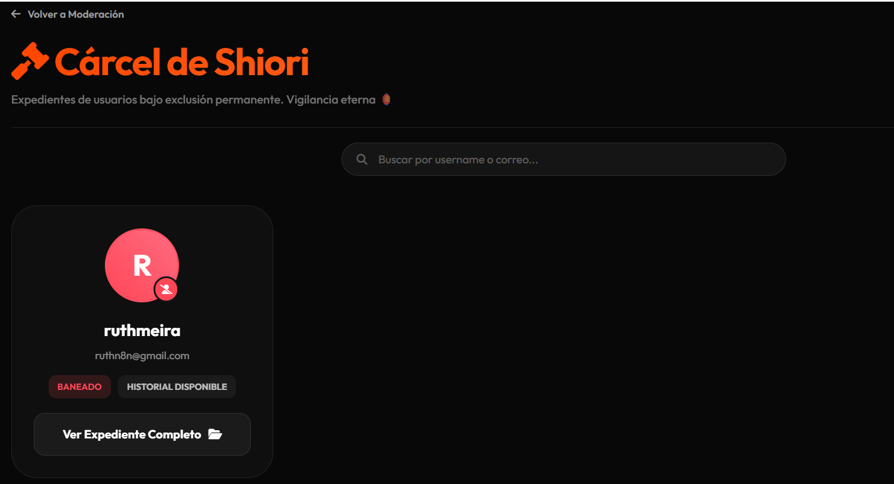
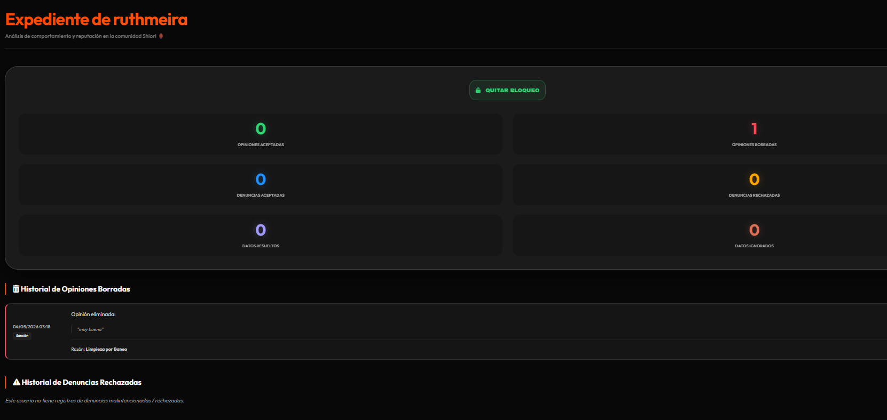
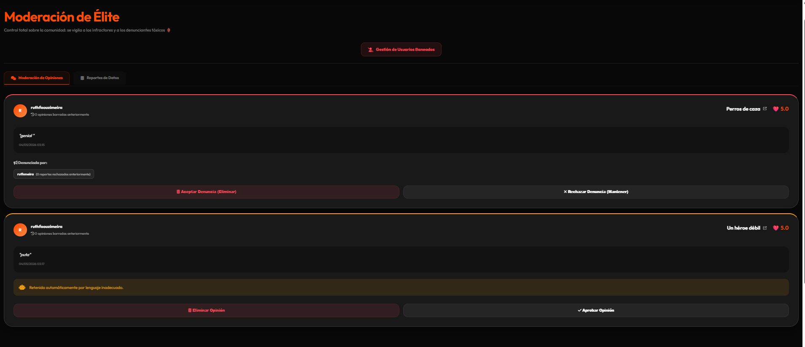
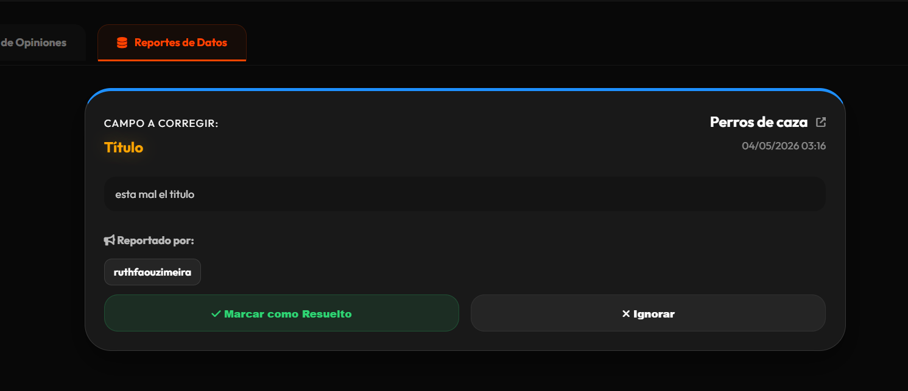

## 6. Despliegue y Dockerización

SHIORI ha sido diseñado bajo una arquitectura de contenedores y desplegado en una infraestructura de nube moderna, garantizando alta disponibilidad y actualizaciones automáticas.

### **6.1. Contenedorización con Docker**
Se utiliza un archivo `Dockerfile` basado en `python:3.10-slim` para empaquetar la aplicación con todas sus dependencias.
*   **Servidor de Producción:** Se utiliza **Gunicorn** con una configuración de 8 hilos para manejar peticiones concurrentes de forma eficiente en la nube.
*   **Portabilidad:** El uso de Docker garantiza que el entorno de desarrollo sea idéntico al de producción, eliminando errores de compatibilidad.

### **6.2. Despliegue Inicial en Google Cloud Run**
Para el primer lanzamiento de la plataforma, se siguieron estos pasos técnicos detallados:

1.  **Preparación de la Infraestructura en la Nube:**
    *   Acceso a **Google Cloud Console** y creación de un proyecto dedicado.
    *   Habilitación manual de las APIs necesarias: `Cloud Run API`, `Cloud Build API` y `Artifact Registry`.
2.  **Configuración y Despliegue por Terminal:**
    *   **Autenticación:** Uso de `gcloud auth login` para vincular la cuenta de Google.
    *   **Inicialización:** Selección del proyecto mediante `gcloud config set project [ID_PROYECTO]`.
    *   **Primer Despliegue:** Se ejecutó el siguiente comando para subir el código y construir la imagen inicial en la nube:
        ```bash
        gcloud run deploy shiori-app --source . --platform managed --region europe-west1 --allow-unauthenticated
        ```
    Este proceso inicial permitió verificar la conectividad de la base de datos Supabase y las APIs externas en el entorno real antes de la automatización.

### **6.3. Automatización (CI/CD) con GitHub**
Una vez verificado el servicio, se implementó un flujo de **Integración y Despliegue Continuo (CI/CD)** para eliminar procesos manuales:

1.  **Configuración de la Conexión:**
    *   En el panel de Cloud Run, se seleccionó "Set up Continuous Deployment".
    *   Se autenticó la conexión con GitHub y se seleccionó el repositorio `asian_platform`.
2.  **Configuración del Trigger (Disparador):**
    *   Se estableció un disparador en **Cloud Build** vinculado a la rama `main`.
    *   **Flujo Automático:** Con cada `git push` a `main`, GitHub notifica a Google Cloud → Cloud Build construye la nueva imagen de Docker → La imagen se almacena en Artifact Registry → Cloud Run despliega la nueva revisión automáticamente.

### **6.4. Dominio y Red con Cloudflare**
El acceso público se gestionó mediante un dominio profesional para ocultar la URL técnica de Google.

1.  **Mapeo de Dominio:** En la consola de Cloud Run ("Manage Custom Domains"), se vinculó el dominio gestionado en **Cloudflare**.
2.  **Configuración DNS:**
    *   Google Cloud proporcionó **8 registros específicos** para la validación y apuntamiento: **4 registros de tipo A** y **4 registros de tipo AAAA**.
    *   Estos registros se introdujeron manualmente en el panel DNS de Cloudflare para completar la propagación y permitir el acceso a través del dominio personalizado.


---
🚀 **Resultado Final:** La plataforma SHIORI está plenamente operativa en el dominio profesional: [**https://myshiori.org**](https://myshiori.org)

## 7. Reflexión Final

**SHIORI** nació de una pasión: la fascinación por las historias que nos llegan desde Asia, por su capacidad de emocionarnos y por la necesidad de encontrar un lugar donde atesorar esos momentos. Más que una plataforma técnica, este proyecto es un "marcapáginas" (*Shiori*) en nuestra propia historia como espectadores.

A lo largo de este desarrollo, cada línea de código ha sido un aprendizaje y cada funcionalidad una pequeña victoria. SHIORI no es solo un agregador de datos; es un espacio diseñado para que la comunidad se sienta como en casa, donde las opiniones cuentan y donde descubrir una nueva serie es como encontrar un tesoro. Este proyecto es el resultado de noches de dedicación, de amor por la cultura asiática y del deseo de crear algo que sea, ante todo, útil y humano.

SHIORI se queda aquí, listo para ser la guía de quien quiera perderse (y encontrarse) en el inmenso mundo del cine y las series de Asia. 🌏🏮✨

